# Azure Functions Hands-On

## 目次

* [開発環境準備](./handson-prepare.md)

1. [Exercise1：Httpトリガー作成（ローカル開発）](#exercise1httpトリガー作成ローカル開発)
1. [Exercise2：Httpトリガー作成（Azureデプロイ）](#exercise2httpトリガー作成azureデプロイ)
1. [Exercise3：Httpトリガー作成（Blob連携）](#exercise3httpトリガー作成blob連携)
1. [Exercise4：Queueトリガー作成](#exercise4queueトリガー作成)
1. [Exercise5：タイマートリガー作成](#exercise5タイマートリガー作成)


---

## Exercise1：Httpトリガー作成（ローカル開発）

本 Exercise ではローカル環境でHttpトリガー関数アプリを作成、実行、テストを行います。

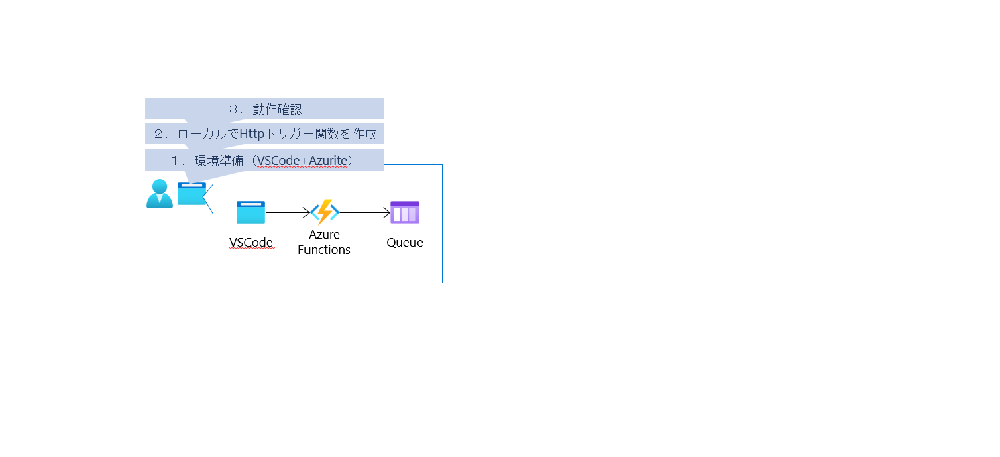

環境準備

1. [事前準備](handson-prepare.md) が終わっているか確認。
    終わっていない場合、事前準備を先に実施する。

プロジェクトのひな形作成

1. 任意のフォルダを作成（プロジェクト用フォルダ作成）
1. 作成したフォルダを Visual Studio Code で開く
1. アクティビティバーにある「Azure」を開く

    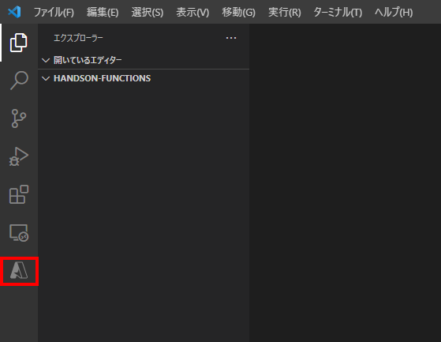

1. 「WORKSPACE」にある「＋」を開き「Create Function...」を選択

    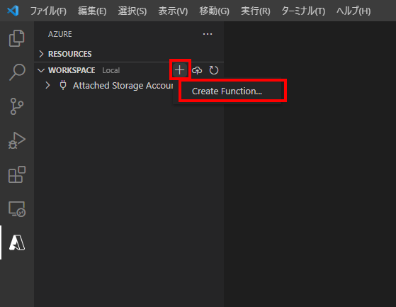

    1. `Select a language` は `JavaScript` を選択
    1. `Select a template for your project's first function` は `HTTP trigger` を選択
    1. `Provide a function name` は任意（デフォルトの `HttpTrigger1` でもOK）
    1. `承認レベル` は `Anonymous` を選択

Azurite の起動

1. アクティビティバーにある「Azure」を開く
1. 「WORKSPACE」にある「Attached Storage Accounts」を展開
1. 「Local Emulator」→「Blob Containers」および「Queues」をそれぞれ展開
1. `Start Blob Emulator` および `Start Queue Emulator` を選択

    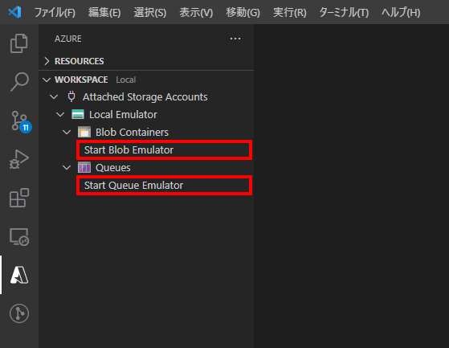

ストレージへの接続文字列を追加

1. `local.settings.json` を開く
1. `Values` に接続文字列用のキー `` を追加
    |キー|値|
    |--|--|
    | `QUEUE_STORAGE_ACCOUNT` | `UseDevelopmentStorage=true` |

    `/local.settings.json`
    ```javascript
    {
      "IsEncrypted": false,
      "Values": {
        "AzureWebJobsStorage": "",
        "FUNCTIONS_WORKER_RUNTIME": "node",
        "QUEUE_STORAGE_ACCOUNT": "UseDevelopmentStorage=true"
      }
    }
    ```

バインド設定の追加

1. 作成した関数フォルダにある `function.json` を右クリック
1. `Add binding...` を選択

    

    1. `Select binding direction` は `out` を選択
    1. `Select binding with direction "out"` は `Azure Queue Storage` を選択
    1. `バインド名` は任意（後の実装ではデフォルトの `outputQueueItem` を利用）
    1. `送信先キュー名` も任意
    1. `Select setting from "local.settings.json"` は `QUEUE_STORAGE_ACCOUNT` を選択

        `/{関数名}/function.json`
        ```javascript
        {
          "bindings": [
            ...(省略)...
            {
              "type": "queue",
              "direction": "out",
              "name": "outputQueueItem",
              "queueName": "outqueue",
              "connection": "QUEUE_STORAGE_ACCOUNT"
            }
          ]
        }
        ```

Httpトリガーの実装

1. `/{関数名}/index.js` を開く
1. 以下のように実装を修正

    `/{関数名}/index.js`
    ```javascript
    module.exports = async function (context, req) {
        context.log('JavaScript HTTP trigger function processed a request.');

        const name = (req.query.name || (req.body && req.body.name));
        const responseMessage = name
            ? "Hello, " + name + ". This HTTP triggered function executed successfully."
            : "This HTTP triggered function executed successfully. Pass a name in the query string or in the request body for a personalized response.";

        // 追記 -- START
        context.bindings.outputQueueItem = responseMessage;
        // 追記 -- END

        context.res = {
            // status: 200, /* Defaults to 200 */
            body: responseMessage
        };
    }
    ```

Httpトリガーの実行/テスト

1. `F5` でデバッグ実行を開始
1. 表示されたリクエスト先へアクセス

    デフォルトだと以下のようなメッセージが出ているはず。
    表示に従って `http://localhost:7071/api/HttpTrigger1` をブラウザで開く

    ```
    Functions:

            HttpTrigger1: [GET,POST] http://localhost:7071/api/HttpTrigger1
    ```

1. 動作確認
    1. ブラウザにメッセージが表示されればリクエストはOK

        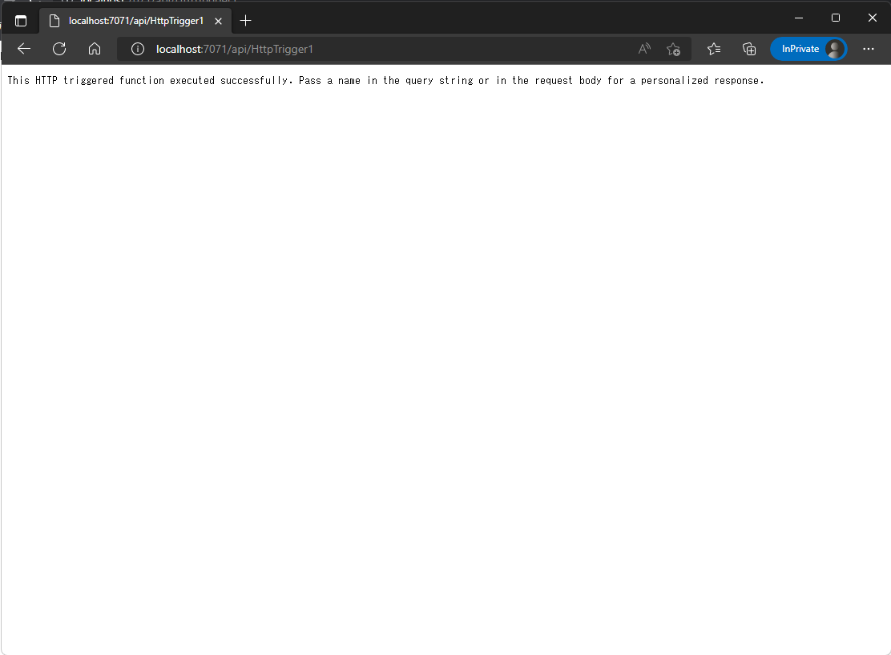

    1. Azure Storage Explorer を開く
        1. 「ローカルで接続済み」-「(エミュレーター-既定のポート)」-「Queues」-「outqueue（設定した名称）」を開く
        1. ブラウザに出ているメッセージと同じメッセージが登録されていればOK

            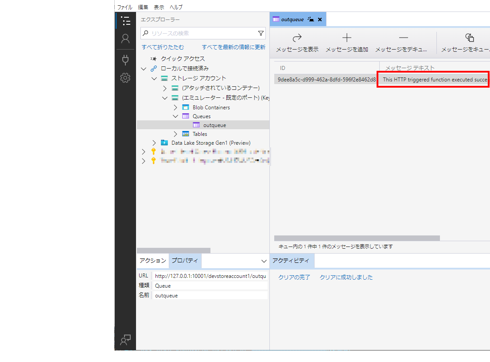


## Exercise2：Httpトリガー作成（Azureデプロイ）

ローカルで作成した関数アプリをAzure上に展開し、動作確認を行います。

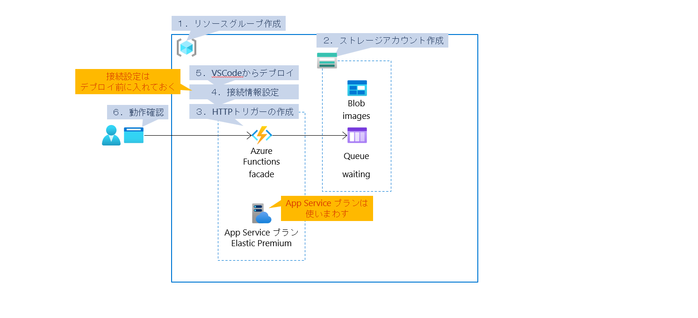

リソースグループ作成

1. Azure ポータルを開く
1. 「リソースグループ」を開く
1. 「作成」を選択してリソースグループを作成

    |項目|値|
    |---|---|
    |リソースグループ名|（任意）|
    |リージョン| `Japan East` |


ストレージアカウント作成

1. Azure ポータルを開く
1. 「ストレージアカウント」を開く
1. 「作成」を選択してストレージアカウントを作成
    1. 基本
        |項目|設定内容|
        |---|---|
        |リソースグループ|（最初に作成したもの）|
        |ストレージアカウント名|（任意）|
        |地域(リージョン)|（リソースグループに合わせる）|
        |パフォーマンス| `Standard` |

        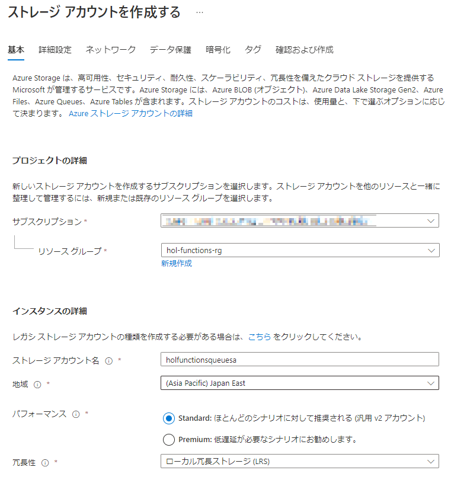

    1. 詳細設定、ネットワーク、データ保護、暗号化、タグ

        （特に設定なし。デフォルトのママ）

    1. 確認および作成

        内容を確認して「作成」を選択


HTTPトリガーの作成（Azure上）

1. Azure ポータルを開く
1. 「関数アプリ」を開く
1. 「作成」を選択して関数アプリを作成
    1. 基本
        |項目|設定内容|
        |---|---|
        |リソースグループ|（最初に作成したもの）|
        |関数アプリ名|（任意。以降は `facade-func` で表記）|
        |公開| `コード` |
        |ランタイムスタック| `Node.js` |
        |バージョン| `14 LTS` |
        |地域(リージョン)|（リソースグループに合わせる）|
        |OS| `Linux` |
        |プランの種類| `Premium` |

        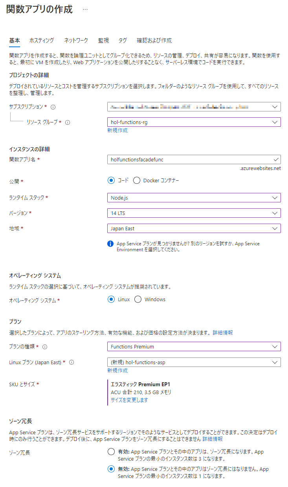

    1. ホスティング、ネットワーク

        （特に設定なし。デフォルトのママ）

    1. 監視
        |項目|設定内容|
        |---|---|
        |Application Insights を有効にする| `はい` |

    1. タグ

        （特に設定なし。デフォルトのママ）

    1. 確認および作成

        内容を確認して「作成」を選択


関数アプリの接続情報設定（Azure上）

1. Azure ポータルを開く
1. 「関数アプリ」を開く
1. 作成済みの関数アプリ（ `facade-func` ）を選択して開く
1. [設定]-[構成]を開く
    1. 「アプリケーション設定」の「新しいアプリケーション設定」を選択

        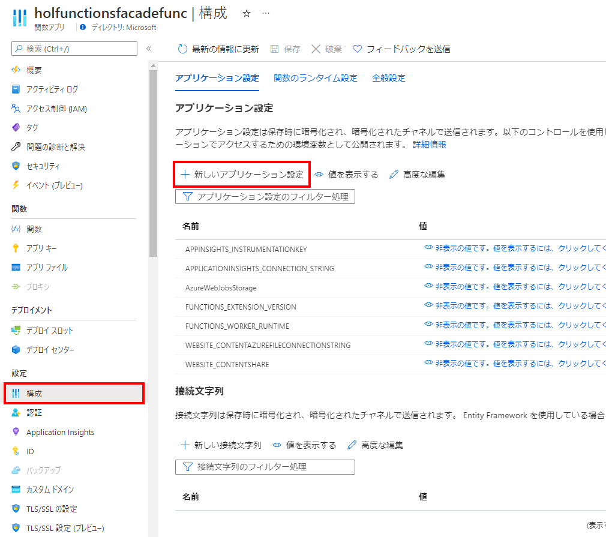

    1. 以下の通り値を設定
        |名前|値|
        |---|---|
        | `QUEUE_STORAGE_ACCOUNT` |作成済みキュー保管用ストレージアカウントの「接続文字列」を設定 <br/> (*) 作成したストレージを開く→[セキュリティとネットワーク]-[アクセスキー]→「キーの表示」 <br/> 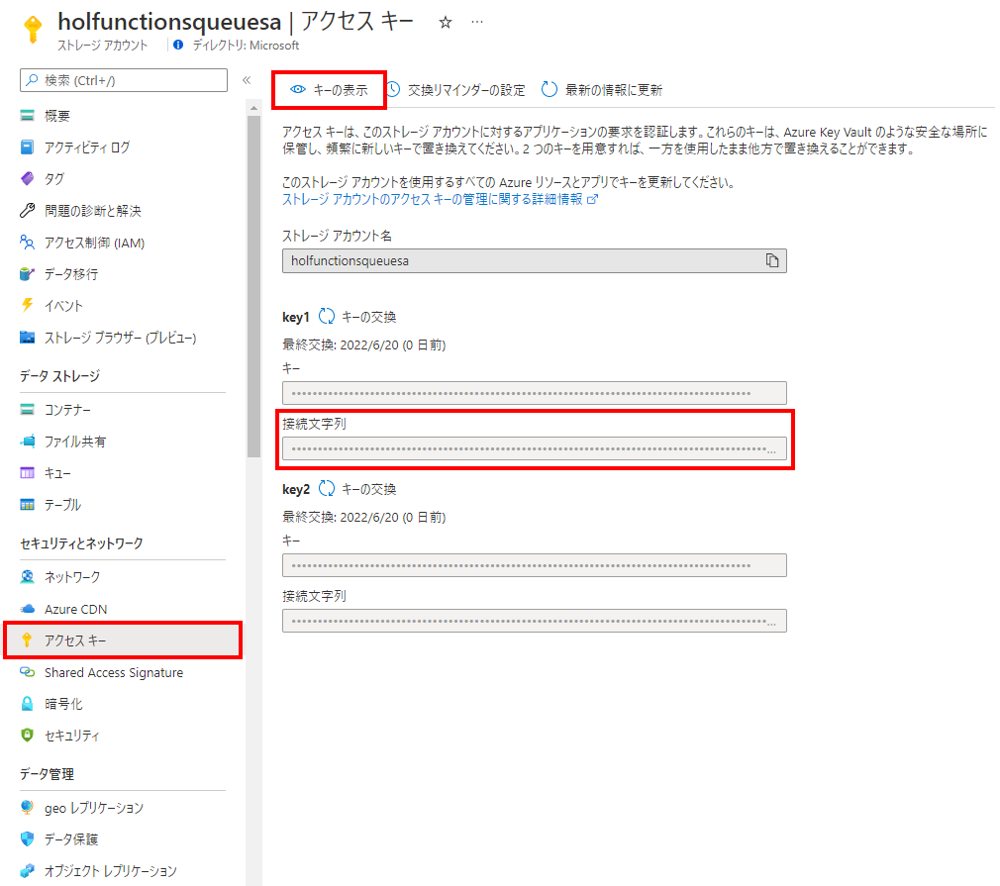|
    1. 「OK」で保存
    1. [構成]画面上部にある「保存」を押下
    2. 「続行」


HTTPトリガーの作成（Visual Studio Code からデプロイ）

1. Exercise1 で作成したプロジェクトを VSCode で開く
1. アクティビティバーにある「Azure」を開く
1. 「WORKSPACE」の横にある「Deploy」を展開
1. 「Deploy to Function App...」を選択

    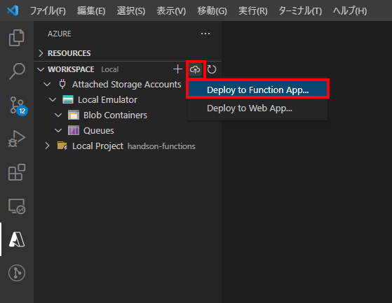

    1. `Select a resource` は作成済みの関数アプリを選択
    1. 上書きしてよいか確認の警告が出るので「Deploy」を選択


HTTPトリガーの実行/テスト

1. Azure ポータルを開く
1. 「関数アプリ」を開く
1. 作成済みの関数アプリ（ `facade-func` ）を選択して開く

    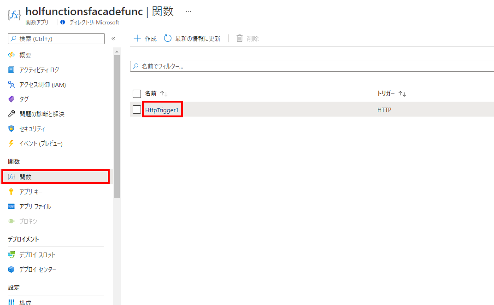

1. 「概要」に表示されている「関数のURLの取得」を選択、表示されるURLをコピー

    

1. 新しくブラウザを立ち上げてコピーしたURLを開く
    1. メッセージが表示されればOK

        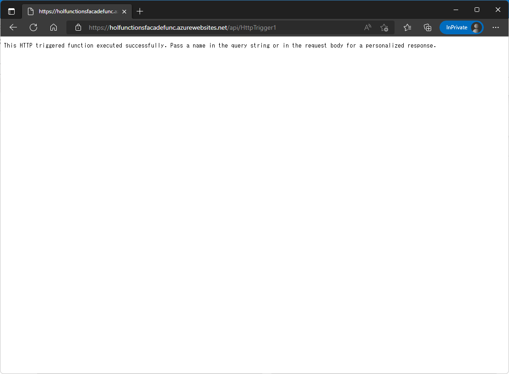

1. 「ストレージアカウント」を開く
1. 作成済みのキュー保管用ストレージアカウントを開く
1. [データストレージ]-[キュー]を開く
    1. 出力先にしていしたキュー名 (デフォルトの場合 `outqueue` ） を開く
    1. キューの内容に先ほどブラウザで表示したメッセージと同じものがあればOK

        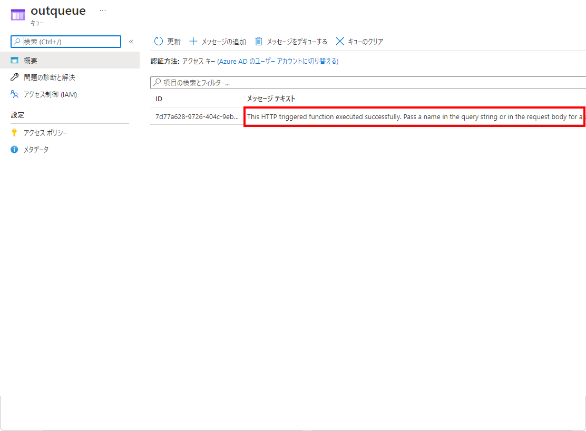


## Exercise3：Httpトリガー作成（Blob連携）

関数アプリに設定を追加

1. Azure ポータルを開く
1. 「関数アプリ」を開く
1. 作成済みの関数アプリ（ `facade-func` ）を選択して開く
1. [設定]-[構成]を開く
1. 「アプリケーション設定」を追加
    1. 「新しいアプリケーション設定」を選択
    1. 以下の設定を追加
        |名前|値|
        |---|---|
        | `QUEUE_STORAGE_ACCOUNT` |（作成済みBlobストレージへの接続文字列）|


HTTPトリガーの上書きデプロイ

1. ダウンロード済み `/server/facade` フォルダを Visual Studio Code で開く
1. アクティビティバーにある「Azure」を開く
1. 「WORKSPACE」の横にある「Deploy」を展開
1. 「Deploy to Function App...」を選択
    1. `Select a resource` は作成済みの関数アプリを選択
    1. 上書きしてよいか確認の警告が出るので「Deploy」を選択
<!--
1. Azure ポータルを開く
1. 「関数アプリ」を開く
1. 作成済みの関数アプリ（ `facade-func` ）を選択して開く
1. [関数]-[関数]を開く
    1. デプロイした関数名 `trainings` を選択
    1. [Developer]-[統合]を開く
    1. 「出力」にある「Azure Queue Storage」を選択
    1. 「Storage account connection」を開いて、
        作成済みのキュー保管用ストレージアカウントへの接続設定を選択
    1. 「保存」を選択
-->

クライアントのデプロイ

1. Azure ポータルを開く
1. 「App Service」を開く
1. 「作成」を選択して「App Service」を作成
    1. 基本
        |項目|設定内容|
        |---|---|
        |リソースグループ|（最初に作成したもの）|
        |アプリ名|（任意。以降は `webclient` で表記）|
        |公開| `コード` |
        |ランタイムスタック| `Node 14 LTS` |
        |OS| `Linux` |
        |地域(リージョン)|（リソースグループに合わせる）|
        |App Service プラン SKU | `開発/テスト F1` |

    1. デプロイ、ネットワーク、監視、タグ

        （特に設定なし。デフォルトのママ）

    1. 確認および作成

        内容を確認して「作成」を選択
<!--  -->
1. `/server/facade` フォルダを Visual Studio Code で開く
1. アクティビティバーにある「Azure」を開く
1. 「WORKSPACE」の横にある「Deploy」を展開
1. 「Deploy to Web App...」を選択
    1. `Select a resource` は作成済みの関数アプリを選択
    1. 上書きしてよいか確認の警告が出るので「Deploy」を選択
<!--  -->
1. Azure ポータルを開く
1. 「App Service」を開く
1. 作成した App Service を開く
1. [設定]-[構成]を開く
1. 「アプリケーション設定」に設定を追加
    1. 「新しいアプリケーション設定」を選択
    1. 以下の値を設定して「OK」
        |名前|値|
        |---|---|
        | `REQUEST_URL` |（関数アプリ（ `facade-func` ）のエンドポイントURL）|
    1. 「保存」を選択
    1. 変更の保存で「続行」を選択


動作確認

1. Azure ポータルを開く
1. 「App Service」を開く
1. 作成した App Service を開く
1. 「概要」にある「URL」をコピーしてブラウザで開く
1. 関数アプリにデータを送信
    |項目|値|
    |---|---|
    |ファイル| `/docs/ImageClassfication/` 以下にあるファイル |
    |タグ| フォルダ名と同じものを指定 |

<!--  -->

1. Storage Explorer を起動
1. 投入先のBlobとQueueを確認
    1. Blob に images が出来上がり、ファイルがアップロードされている
    1. Queues に waiting が出来上がり、JSONが投入されている。
        `guid` が Blob に投稿されたファイル名と一致している。
        ```
        {
          "guid": "b5dc6f55-91b4-4cc2-bff5-d677bdd34e2a",
          "tag": "Hemlock"
        }
        ```


## Exercise4：Queueトリガー作成

Custom Vision 作成（リソース作成）

1. Azureポータルを開く
1. 「Cognitive Service」を開く
1. [Vision]-[Cusom Vision]を開く
1. 「作成」からリソースを作成
    1. 基本
        |項目|設定内容|
        |---|---|
        |作成オプション|両方|
        |サブスクリプション|（作成済みのもの）|
        |地域(リージョン)|（リソースグループに合わせる）|
        |名前|（任意）|
        |トレーニング価格レベル| `Free F0` (選択できれば) |
        |予測価格レベル| `Free F0` (選択できれば) |

    1. ネットワーク、タグ

        （特に設定なし。デフォルトのママ）

    1. 確認および作成

        内容を確認して「作成」を選択
1. 作成されたリソースのうち「トレーニング」のリソースを開く
1. [リソース管理]-[キーとエンドポイント]を開く
1. 以下の値をメモしておく
    * `キー1`
    * `エンドポイント`

Custom Vision 作成（プロジェクト作成）

1. 以下のアドレス（Custom Vision のプロジェクトページ）へアクセス

    https://www.customvision.ai/projects

1. 「NEW PROJECT」を選択してプロジェクトを作成
    1. 以下の設定をして「Create project」を選択

        |項目|値|
        |---|---|
        |Name|（任意）|
        |Resource|（前手順で作成したリソース）|
        |Project Type| `Classfication` |
        |Classification Types| `Multiclass (Single tag per image)` |
        |Domains| `General [A2]` |

1. 画面右上にある「歯車」を選択
1. 以下の値をメモしておく
    * `Project Id`

Queueトリガー関数アプリの作成

1. Azureポータルを開く
1. 「関数アプリ」を開く
1. 「作成」からリソースを作成
    1. 基本
        |項目|設定内容|
        |---|---|
        |リソースグループ|（最初に作成したもの）|
        |関数アプリ名|（任意。以降は `regist-func` で表記）|
        |公開| `コード` |
        |ランタイムスタック| `Node.js` |
        |バージョン| `14 LTS` |
        |地域(リージョン)|（リソースグループに合わせる）|
        |OS| `Linux` |
        |プランの種類| `Premium` |
        |Linuxプラン|（最初の関数アプリ作成時に作成した App Service プラン）|

    1. ホスティング

        |項目|設定内容|
        |---|---|
        |ストレージアカウント|（最初の関数アプリ作成時に作成したもの）|

    1. ネットワーク

        （特に設定なし。デフォルトのママ）

    1. 監視
        |項目|設定内容|
        |---|---|
        |Application Insights を有効にする| `はい` |
        |Application Insights|（最初の関数アプリ作成時に作成したもの）

    1. タグ

        （特に設定なし。デフォルトのママ）

    1. 確認および作成

        内容を確認して「作成」を選択

接続文字列設定

1. Azureポータルを開く
1. 「関数アプリ」を開く
1. 作成済みのQueueトリガー関数アプリ（ `regist-func` ）を開く
1. [設定]-[構成]を開く
1. 「アプリケーション設定」を追加
    1. 「新しいアプリケーション設定」を選択、入力、「OK」

        |名前             |値|
        |-----------------------|---|
        |`QUEUE_STORAGE_ACCOUNT`  |（共有キューストレージへの接続文字列）|
        |`CV_PROJECT_ID`          |（Custom Vision のプロジェクトID）|
        |`CV_TRAINING_KEY`        |（Custom Vision のトレーニングキー）|
        |`CV_TRAINING_ENDPOINT`   |（Custom Vision のトレーニングエンドポイント）|

    1. すべて追加し終えたら「保存」を選択
    1. 「変更の保存」で「続行」を選択


Queueトリガー関数アプリのデプロイ

1. ダウンロード済み `/server/regist` フォルダを Visual Studio Code で開く
1. アクティビティバーにある「Azure」を開く
1. 「WORKSPACE」の横にある「Deploy」を展開
1. 「Deploy to Function App...」を選択
    1. `Select a resource` は作成済みのQueueトリガー関数アプリ（ `regist-func` ）を選択
    1. 上書きしてよいか確認の警告が出るので「Deploy」を選択


動作確認

1. Azure ポータルを開く
1. 「App Service」を開く
1. 作成したクライアント App Service を開く
1. 「概要」にある「URL」をコピーしてブラウザで開く
1. 関数アプリにデータを送信
    |項目|値|
    |---|---|
    |ファイル| `/docs/ImageClassfication/` 以下にあるファイル |
    |タグ| フォルダ名と同じものを指定 |

<!--  -->

1. Custom Vision のプロジェクト一覧ページを開く

    https://www.customvision.ai/projects

1. 作成済みのプロジェクトを開く
1. 登録した画像とタグが設定されていればOK


## Exercise5：タイマートリガー作成

タイマートリガー関数アプリの作成

1. Azureポータルを開く
1. 「関数アプリ」を開く
1. 「作成」からリソースを作成
    1. 基本
        |項目|設定内容|
        |---|---|
        |リソースグループ|（最初に作成したもの）|
        |関数アプリ名|（任意。以降は `trainer-func` で表記）|
        |公開| `コード` |
        |ランタイムスタック| `Node.js` |
        |バージョン| `14 LTS` |
        |地域(リージョン)|（リソースグループに合わせる）|
        |OS| `Linux` |
        |プランの種類| `Premium` |
        |Linuxプラン|（最初の関数アプリ作成時に作成した App Service プラン）|

    1. ホスティング

        |項目|設定内容|
        |---|---|
        |ストレージアカウント|（最初の関数アプリ作成時に作成したもの）|

    1. ネットワーク

        （特に設定なし。デフォルトのママ）

    1. 監視
        |項目|設定内容|
        |---|---|
        |Application Insights を有効にする| `はい` |
        |Application Insights|（最初の関数アプリ作成時に作成したもの）

    1. タグ

        （特に設定なし。デフォルトのママ）

    1. 確認および作成

        内容を確認して「作成」を選択

接続文字列設定

1. Azureポータルを開く
1. 「関数アプリ」を開く
1. 作成済みの タイマートリガー関数アプリ（ `trainer-func` ）を開く
1. [設定]-[構成]を開く
1. 「アプリケーション設定」を追加
    1. 「新しいアプリケーション設定」を選択、入力、「OK」

        |名前             |値|
        |-----------------------|---|
        |`CV_PROJECT_ID`          |（Custom Vision のプロジェクトID）|
        |`CV_TRAINING_KEY`        |（Custom Vision のトレーニングキー）|
        |`CV_TRAINING_ENDPOINT`   |（Custom Vision のトレーニングエンドポイント）|

    1. すべて追加し終えたら「保存」を選択
    1. 「変更の保存」で「続行」を選択


タイマートリガー関数アプリのデプロイ

1. ダウンロード済み `/server/trainer` フォルダを Visual Studio Code で開く
1. アクティビティバーにある「Azure」を開く
1. 「WORKSPACE」の横にある「Deploy」を展開
1. 「Deploy to Function App...」を選択
    1. `Select a resource` は作成済みのQueueトリガー関数アプリ（ `trainer-func` ）を選択
    1. 上書きしてよいか確認の警告が出るので「Deploy」を選択


動作確認

1. Custom Vision のプロジェクトへ学習画像を登録
    1. Custom Vision のプロジェクト一覧を開く

        https://www.customvision.ai/projects

    1. 作成したプロジェクトを開く
    1. 「Add images」を選択して学習させる画像を登録

        |画像|タグ|
        |---|---|
        |`/ImageClassification/Hemlock` 以下にある画像| `Hemlock` |
        |`/ImageClassification/Japanese_Cherry` 以下にある画像| `Japanese_Cherry` |

1. タイマートリガー関数アプリを手動実行
    1. Visual Studio Code を開く
    1. [ファイル]-[新しいファイル]を開く
    1. 右下の言語モード（ステータスバー上の `プレーンテキスト` ）を選択して「HTTP」に変更
    1. 以下のリクエストを作成して「Send Request」を選択

        ```
        POST https://{タイマー関数アプリのホスト名}/admin/functions/TimerTrigger1
        x-functions-key: {タイマー関数アプリのマスターキー}
        Content-Type: application/json

        {}
        ```

        `202 Accepted` の応答があれば実行できた状態。
        関数アプリの [監視]-[ログストリーム] を開いておいても実行されたかどうか確認できる。

1. Custom Vision でトレーニングが開始されたことを確認
    1. Custom Vision のプロジェクト一覧を開く

        https://www.customvision.ai/projects

    1. 作成したプロジェクトを開く
    1. 「Performance」タブへ移動
        * `Iteration` が作成されていればOK


